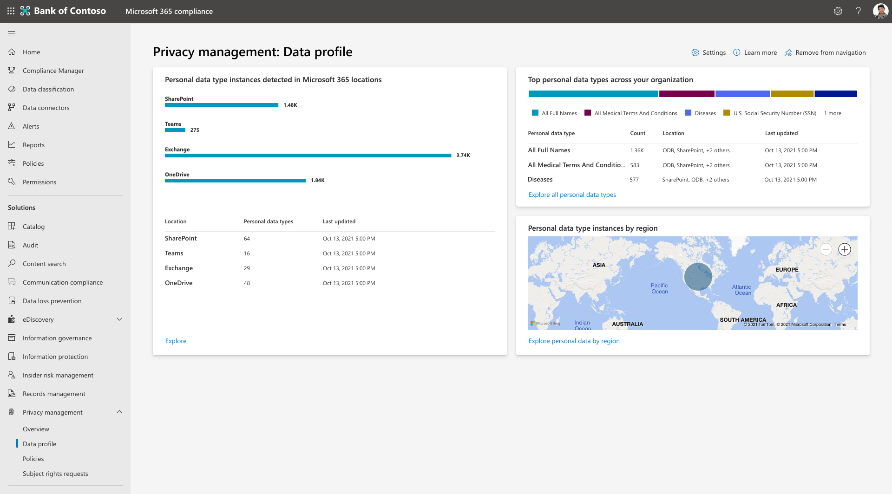

# Suchen und Visualisieren personenbezogener Daten in der Datenschutzverwaltung

Das Datenschutzmanagement hilft Ihnen, die Daten zu verstehen, die Ihre Organisation speichert, indem sie die Ermittlung von personenbezogenen Datenressourcen automatisiert und Visualisierungen wichtiger Informationen bereitstellt. Diese Visualisierungen finden Sie auf den **Übersichts-** und **Datenprofilseiten.** Sie können auf die Hierinblicke reagieren, um den Datenschutz Ihrer Organisation zu stärken und Risiken zu verringern.

Wechseln Sie zunächst zum Abschnitt "Datenschutzverwaltung" des [Microsoft 365 Compliance Center,](https://compliance.microsoft.com/) und zeigen Sie die folgenden Seiten an:

- **Übersicht:** Bietet einen Überblick über die Daten Ihrer Organisation in Microsoft 365. Datenschutzadministratoren können Trends und Aktivitäten überwachen, potenzielle Risiken im Zusammenhang mit personenbezogenen Daten erkennen und untersuchen und wichtige Aktivitäten wie Richtlinienverwaltung oder Anfragen von Antragstellerrechten ins Blickpunkt treten.
- **Datenprofil:** Stellt eine Momentaufnahme der personenbezogenen Daten bereit, die Ihre Organisation in Microsoft 365 speichert. Auf dieser Seite können Sie visualisieren, wo personenbezogene Daten gespeichert sind, welche Typen in Ihrer Organisation am weitesten verbreitet sind und wie viele verschiedene Typen an verschiedenen Standorten in Ihrer Microsoft 365 Umgebung vorhanden sind. Sie können auch personenbezogene Daten von diesem Ort aus erkunden.

Wenn Sich Ihre Daten ändern und die Datenverwaltung neue Ergebnisse macht, werden die auf diesen Seiten angezeigten Informationen aktualisiert. Beachten Sie, dass es bis zu 24 Stunden dauern kann, bis neue Daten in den Diagrammen dargestellt werden.

## Erkunden der Übersichtsseite

Die Übersichtsseite besteht aus drei Hauptabschnitten. Kacheln oben auf der Seite stellen wichtige aktuelle Statistiken zu Ihren Daten bereit. Der Abschnitt mit den wichtigsten Erkenntnissen bietet Untersuchungsmöglichkeiten zu Trends und Bereichen von zentralem Interesse. Weitere Informationen zu Ihrer Datenumgebung finden Sie in den Trendliniendiagrammen. Weitere Informationen zu diesen Bereichen finden Sie in den folgenden Abschnitten.

### Top-Kacheln

#### Richtlinienüberstimmungen in den letzten 7 Tagen

Wenn Richtlinien innerhalb der Datenschutzverwaltung festgelegt werden, werden Ihre Daten basierend auf Ihren Richtlinien für bestimmte Bedingungen ausgewertet, die Datenschutzrisiken darstellen können. Richtlinienüberstimmungen deuten auf Datenentdeckungen hin, die möglicherweise einer weiteren Überprüfung oder Korrektur bedürfen. Diese Kachel zeigt, wie viele Richtlinienüberstimmungen innerhalb der letzten sieben Tage aufgetreten sind. Hier werden Übereinstimmungen angezeigt, unabhängig davon, ob Richtlinien aktiviert sind oder im Testmodus ausgeführt werden, sodass Sie die Ergebnisse aller aktiven Richtlinien sehen können. Wenn Sie diese Kachel auswählen, gelangen Sie zu einer gefilterten Ansicht der Seite **"Richtlinien"** der Datenschutzverwaltung, auf der die Richtlinien angezeigt werden, bei denen innerhalb der letzten sieben Tage eine Übereinstimmung aufgetreten ist.

#### Elemente mit personenbezogenen Daten

Um die automatisierten Ermittlungsfunktionen der Datenschutzverwaltungslösung bei der Arbeit anzuzeigen, überprüfen Sie die Kachel **"Elemente mit persönlichen Daten".** Diese Kachel zeigt, wie viele neue Elemente, die personenbezogene Daten basierend auf Ihren Einstellungen enthalten, in den letzten sieben Tagen in der Microsoft 365 Umgebung Ihrer Organisation entdeckt wurden. Wenn Sie diese Kachel auswählen, wird eine Ansicht der neuesten 100 ermittelten Elemente geladen.

#### Anträge auf Rechte von Antragstellern

Die Übersichtsseite enthält eine Kachel, die zeigt, wie viele Antragstellerrechteanforderungen in den letzten sieben Tagen erstellt wurden. Eine zweite Kachel zeigt ggf. an, wie viele Anforderungen basierend auf den festgelegten Stichtagen überfällig sind und möglicherweise sofortige Aufmerksamkeit erfordern. Wenn Sie diese Kacheln auswählen, erhalten Benutzer die entsprechenden Berechtigungen für die Seite "Antragstellerrechte anfordern" der Datenschutzverwaltung.

### Wichtige Erkenntnisse

#### Inhaltselemente mit den persönlichsten Daten

Inhalte, die eine große Menge an personenbezogenen Daten enthalten, können ein höheres Risiko einer Gefährdung darstellen. Sie können diese Elemente überprüfen, um sicherzustellen, dass sie von einer Datenschutzrichtlinie abgedeckt werden. Um diese Elemente auf Sich aufmerksam zu machen, bietet die Übersichtsseite eine Ansicht ihrer Inhaltselemente, die gemäß Ihren Einstellungen die persönlichsten Daten enthalten. Hier sehen Sie die Anzahl der erkannten eindeutigen personenbezogenen Datentypen, wie viele eindeutige Inhaltsbesitzer identifiziert wurden und wie viele betroffene Personen gemäß den Datenabgleichseinstellungen für Anträge betroffener Personen identifiziert wurden.

Wählen Sie **"Zusammenfassung anzeigen"** aus, um eine Zusammenfassungsansicht der gefundenen Elemente anzuzeigen. Sie können **diese** Ergebnisse auch erkunden, um eine Vorschau einzelner Dateien anzuzeigen. In dieser Ansicht werden maximal 100 Elemente angezeigt. Benutzer in der Rollengruppe "Datenschutzverwaltung" können Dateien auswählen, um Details zu überprüfen und die Relevanz zu ermitteln, und die Liste im .csv Format zur Referenz exportieren.

#### Richtlinien mit den meisten Übereinstimmungen in der letzten Woche

Diese Einblicke zeigen, welche Richtlinien in den letzten sieben Tagen am häufigsten abgeglichen wurden, sei es im "Ein"-Modus oder im "Testen". Es hilft ihnen, die Leistung Ihrer Richtlinien und die Auswirkungen der laufenden Arbeit zu veranschaulichen, wenn Ihre Benutzer in der Datenverwaltung ihr Datenschutzverhalten verfeinern.

Wählen Sie **"Zusammenfassung anzeigen"** aus, um eine Zusammenfassung der 10 am häufigsten gefundenen Richtlinien und der Inhaltsbesitzer der zugeordneten Inhalte anzuzeigen. Außerdem wird angezeigt, wie viele Benutzerbenachrichtigungen aufgrund dieser Richtlinienüberstimmungen gesendet wurden und wie viele Benutzeraktionen ausgeführt wurden. Wählen Sie **"Untersuchen"** aus, um die Seite "Richtlinien" in der Datenschutzverwaltung anzuzeigen, gefiltert, um die Richtlinien aus der Zusammenfassungsansicht anzuzeigen. In dieser Untersuchungsansicht werden Statistiken für die gesamte Lebensdauer der Richtlinie angezeigt. Wählen Sie ihn aus, um Details anzuzeigen, z. B. wann übereinstimmende Elemente anfänglich erkannt wurden.

#### Benutzer, deren Richtlinie in der letzten Woche am häufigsten abgeglichen wurde

Dieser Einblick befasst sich auch mit Übereinstimmungen aus Richtlinien im "Testmodus" oder im "Ein"-Modus. Sie können eine Zusammenfassung der Benutzer mit den meisten Richtlinienübereinstimmungen in der letzten Woche anzeigen und welche Richtlinien sie abgleichen. Dies umfasst Summen der eindeutigen Inhaltsbesitzer, an diese Benutzer gesendete Benachrichtigungen und wie viele Aktionen aus diesen Benachrichtigungen ausgeführt wurden. Wenn Sie **"Untersuchen"** auswählen, gelangen Sie zur Seite "Richtlinien", gefiltert, um die Richtlinien aus der Zusammenfassungsansicht anzuzeigen. In der Untersuchungsansicht finden Sie keine Benutzerinformationen, aber Sie können eine Richtlinie auswählen, um Richtliniendetails im Zusammenhang mit diesen Übereinstimmungen anzuzeigen.

#### Elemente mit den meisten Inhalten betroffener Personen

Dieser Einblick verweist auf Informationen aus der Datenabgleichsfunktion in Anträgen auf Rechte von Betroffenen und stellt Inhaltselemente dar, die in Microsoft 365 gefunden werden, die die meisten betroffenen Personen enthalten. Weitere Informationen zu dieser Einstellung finden Sie unter [Verwalten von Antragstellerrechten.](privacy-management-subject-rights-requests.md)

Diese Elemente können Ihnen helfen, Ihre Datenabgleichskonfiguration zu bestätigen und Datenschutzrisiken im Zusammenhang mit diesen Elementen zu mindern. Wählen Sie **Zusammenfassung** anzeigen für eine Zusammenfassungsansicht aus. Wählen Sie **"Erkunden"** aus, um eine detaillierte Ansicht von bis zu 100 dieser Elemente zu finden. Hier können Sie eine Vorschau dieser Elemente anzeigen und die Relevanz ermitteln und die Liste im .csv Format exportieren.

### Trendliniendiagramme

Dynamische Visualisierungen von Trends, die in den Daten Ihrer Organisation zu finden sind, finden Sie in den Trendliniendiagrammen. Diese Diagramme können nach Merkmalen wie Zeiträumen, Datentypen oder Speicherorten von Daten gefiltert werden. Verwenden Sie die bereitgestellten Dropdowns, um Ihre Ansicht anzupassen. Wenn Sie mit dem Mauszeiger über Linien im Diagramm zeigen, können Sie Statistiken anzeigen, die sich auf diesen bestimmten Zeitpunkt beziehen.

Zu den Ergebnissen im Zusammenhang mit Richtlinien gehören Daten aus Richtlinien im Modus "Test" und "Ein". Wenn keine Richtlinien eines bestimmten Typs aktiv sind, werden in den zugehörigen Diagrammen keine Ergebnisse angezeigt.

#### Warnungen bei aktiven Richtlinien

In diesem Bereich wird eine Momentaufnahme der aktiven Warnungen angezeigt, die durch Richtlinienübersprechung ausgelöst werden. Im Laufe der Zeit kann diese Ansicht Ihnen helfen, Anomalien wie große Mengenspitzen leichter zu erkennen. Wählen Sie **Warnungen anzeigen** aus, um zur Seite "Richtlinien" innerhalb der Datenschutzverwaltung zu navigieren, auf der Sie Warnungen weiter untersuchen und Probleme für die Behebung erstellen können.

#### In der Organisation gefundene personenbezogene Daten

Dieses Diagramm zeigt Trends in bezug darauf, wie viele personenbezogene Daten, die Ihren Einstellungen entsprechen, im Laufe der Zeit in Ihrer Microsoft 365 Umgebung ermittelt wurden und wo sie sich befinden. Sie beginnt mit dem Auffüllen, nachdem die Datenverwaltung für genügend Zeit ausgeführt wurde und nachdem Inhalte mit personenbezogenen Daten innerhalb SharePoint, OneDrive, Teams und/oder Exchange gefunden wurden.

#### In der Organisation erkannte Datenübertragungen

Dieses Diagramm bezieht sich auf Datenübertragungsrichtlinien. Sie bietet eine Übersicht darüber, wie Daten innerhalb Ihrer Organisation verschoben werden, entweder zwischen Abteilungen oder zwischen Regionen für Multi-Geo-Organisationen.

#### Nicht verwendete personenbezogene Daten

Dieses Diagramm bezieht sich auf Richtlinien zur Datenminimierung. Es bietet Einblicke, wie Ihre Organisation Inhalte mit personenbezogenen Daten speichert und wie Ihre Richtlinien den Umgang mit diesen Daten im Laufe der Zeit verbessern können.

#### Überlastete personenbezogene Daten

Dieses Diagramm bezieht sich auf Datenüberlastungsrichtlinien. Es kann Ihnen helfen, Freigabeverhalten im Laufe der Zeit innerhalb Ihrer Organisation und Speicherorte zu identifizieren, an denen Inhalte mit personenbezogenen Daten möglicherweise überlastet sind, z. B. indem sie öffentlich, für einen externen Benutzer freigegeben oder in Ihrer Organisation umfassend freigegeben werden.

#### Anträge betroffener Personen nach Verordnung

Diese Ansicht bietet Einblicke in die Vorschriften, die ihre Anträge auf Rechte betroffener Personen im Laufe der Zeit am häufigsten vorantreiben. Die Legende dieses Diagramms zeigt die Namen der trendenden Bestimmungen. Wenn Sie mit dem Mauszeiger über die Trendlinien zeigen, werden die Gesamtsummen der Anträge betroffener Personen angezeigt, die während der ausgewählten Zeit für diese Verordnung geöffnet wurden.

#### Anträge von Antragstellerrechten nach Status

Dieses Diagramm zeigt, wie Ihre Organisation mit der Erledigung von Anträgen auf Betreffrechte arbeitet, aufgeteilt in Anforderungen, die entweder **aktiv,** **geschlossen** oder **überfällig** sind. Die hier vorgestellten Ergebnisse können ihnen helfen, anzugeben, wo Sie von der Zuweisung weiterer Ressourcen profitieren könnten, um Ihre Anforderungen zu schließen und Ziele zu erfüllen.

### Zusätzliche Datenansichten

#### Anträge auf Rechte betroffener Personen auf einen Blick

Diese Ansicht bietet eine allgemeine Ansicht der Anträge aktiver Antragstellerrechte, einschließlich der verbleibenden Zeit zum Abschließen von Anforderungen bis zu ihren Stichtagen. Es wird zusammengefasst, wie viele Anforderungen Sie insgesamt haben, wie viele aktiv sind und wie viele geschlossen sind. Wählen Sie **"Alle Anforderungen anzeigen"** aus, um zur Seite zur Anforderung von Betreffrechten zu wechseln, auf der Sie weitere Details anzeigen und an den aktiven Anforderungen arbeiten können, um sie bis zum Abschluss zu führen.

#### Anträge betroffener Personen nach Dementhaltung

Diese Kartenansicht hilft Ihnen bei der Visualisierung Ihres Umfangs von Anträgen auf Rechte von Betroffenen durch den Wohnsitz der betroffenen Personen. Wenn Sie mit dem Mauszeiger auf eine Blase zeigen, werden die Region und die Gesamtzahl der Anträge betroffener Personen identifiziert, die im Auftrag von Dort ansässigen Personen geöffnet wurden.

## Erkunden der Datenprofilseite

Die Seite "Datenprofil" in der Datenverwaltung bietet eine Momentaufnahme der personenbezogenen Daten, die Ihre Organisation in Microsoft 365 speichert und wo sie sich befinden. Außerdem erhalten Sie Einen Einblick in die Arten von Daten, die Sie speichern. Die Hauptkacheln umfassen Folgendes.

### In Microsoft 365 erkannte Instanzen von persönlichen Datentypen

Mit dieser Kachel können Sie anhand Ihrer Einstellungen visualisieren, wie viele personenbezogene Daten in Ihrer Microsoft 365 umgebung vorhanden sind und wie diese Daten über Exchange, OneDrive, SharePoint und Teams verteilt werden.

Das Balkendiagramm zeigt die ungefähre Aggregatanzahl eindeutiger Instanzen des persönlichen Datentyps, die in Ihren Inhalten gefunden werden. Beispiele für Datentypen können z. B. Kreditkartennummern und Sozialversicherungsnummern sein. Daher würde eine ermittelte Datei, die drei Kreditkartennummern und eine Sozialversicherungsnummer enthält, zwei eindeutige personenbezogene Datentypen und vier Instanzen enthalten. Der untere Teil dieser Kachel zeigt die eindeutigen persönlichen Datentypen an jedem Microsoft 365 Speicherort an. Sie bietet einen Einblick in die Vielfalt der personenbezogenen Datentypen, die in den Inhalten Ihrer Organisation erkannt werden.

### Die wichtigsten typen personenbezogener Daten in Ihrer Organisation

Diese Kachel enthält eine Momentaufnahme der wichtigsten in Ihrer Umgebung erkannten typen personenbezogener Daten sowie Informationen dazu, wie viele Elemente diesen persönlichen Datentyp enthalten und an welchen Speicherorten.

### Instanzen des persönlichen Datentyps nach Region

Für Multi-Geo-Umgebungen aggregiert diese Kachel Instanzen des typs "Personenbezogener Daten" regional, die sich in Ihren Inhalten befinden, basierend auf den Regionen, in denen diese Inhalte gehostet werden. Für Organisationen mit einer Region zeigt diese Kachel einen Punkt an, der Ihren Microsoft 365 Ort darstellt. Wenn Sie auf der Karte auf Punkte zeigen, wird die ungefähre Anzahl der in dieser Region entdeckten Instanzen des typs "Personenbezogener Datentyp" angezeigt.

### Erkunden von Inhalten

Wenn Sie **"Durchsuchen"** auf einer beliebigen Datenprofilkachel auswählen, wird der Inhalts-Explorer geöffnet. Zu diesem Zeitpunkt können Sie nicht nach einem bestimmten Inhaltselement suchen, und in dieser Ansicht werden keine Teams Daten angezeigt. Dies bedeutet, dass Zahlen im Inhalts-Explorer möglicherweise nicht mit den auf der Datenprofilseite angezeigten Zahlen übereinstimmen, da die Datenprofilseite Teams Inhalt enthält. Datenschutzadministratoren, die weitere Einblicke in ihre Datenschutzdaten benötigen, können dies hier basierend auf dem Typ personenbezogener Daten (Typ vertraulicher Informationen) oder nach Standort (Exchange, OneDrive oder SharePoint) tun.

## Haftungsausschluss

[Haftungsausschluss für Datenschutzverwaltung](privacy-management-disclaimer.md)
